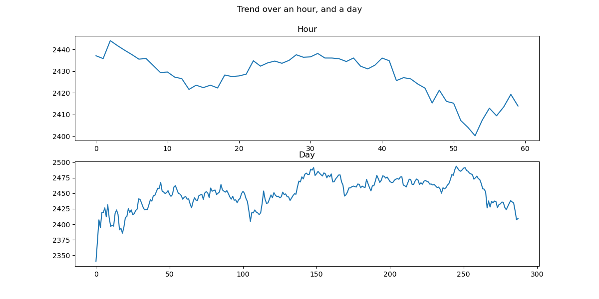
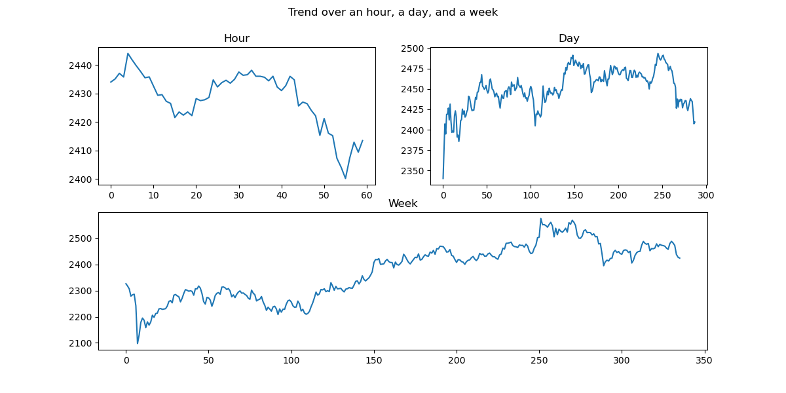

# Crypto-Analysis 
> A better suited name would be ether analysis (for now).

## Motivation:
The program sprang out of a curiosity to programmatically manage a portfolio of cryptocurrencies. However, it's a big concept, so I wanted to start my research into this field through understanding the market of the **ethereum** cryptocurrency. For that reason, I used **coinbase's** api to collect the eth price data, and implemented 4 functionalities that are useful tools for market analysis:
- Collect and store ether price data.
- Show a continuously changing live graph of ether's price.
- Notify the user via mail if the price of eth changes by a certain threshold.
- See how the price changed over specific intervals, this is similar to the one on the coinbase's website.

## Interface:
The entry point of the program is main.py using the following command:
```
python main.py <options>
``` 

There are 3 options:
### 1. Collect:
```
python main.py --collect
``` 

This option perpetually calls one of the coinbase's end-point to fetch price data every minute and append it to a database locally, and prints the latest price on the terminal. The program is ended normally when the user presses the ```Q```. Note: There might be a delay of upto 1 minute before the program quits, because the I'm not sure how to end threads while they are sleeping.

### 2. Live Graph:
```
python main.py --live
``` 

This option continuously updates a graph whenever the latest price is updated in the coinbase's server and stores it on to the same database locally that is shared by the collect option. A speeded out version of the output is given below (*it might take a while to load*):


### 3. Visualize Intervals: 
```
python main.py --viz -[hdwmy]
``` 

For the second argument, select any of the substring (in any order) of ```hdwmy``` (without the brackets). E.g. ```python main.py --viz -wdm```. Here, the letters correspond to the intervals: (h)our, (d)ay, (w)eek, (m)onth & (y)ear. If no argument is given it will show results for *hour* & *day*.


This option simultaneously shows the change in price over specific intervals. However, this option is mainly to see the trend of the currency over specific intervals simultaneously, that's why I didn't include the time in the x-axis. Here, are 2 images of the output of the function: 

 

### 4. Notify Via Mail:
This isn't an explicit option, rather it will automatically be started as a daemon process whenever --collect or --live is selected.

So, currently, these are the main functionalities of the program. However, I've tried to set it up in a way that I can generalize the functions to arbitrary crypto-currencies later. The email would be sent based on users preference that can be adjusted in the main.py function, and there will be a maximum of 1 mail every half an hour. Currently, the program supports the rule where if the currency rise or fall by 3% percent in the past hour, then the user will be notified.

## Implementation:
Firstly, one of the core functionality of the program is to store the price data in a database. Here, I've used **sqlite3** to store the data, and every other function fetches the relevant data out of the database, after the database is updated.

Secondly, all of the visualization is done using **matplotlib**. This is the first time that I've used matplotlib extensively for a project, and for sure this wasn't easy, because matplotlib has such a vast ecosystem. That's why, ended up having to incrementally add things, so maybe some functionalities could've been executed in a better way, I'll definitely revise the code later if I find a better way to program some of the parts of the code, but for now I think it gets the job done pretty well.

Lastly, I use **google's oauth 2.0** to get mailing access, and then use the access and refresh token to access google's api for sending mails. If you wanna set up the system for yourself, firstly follow the links in notify.py, then get the credentials.json, and create the individuals.json file (explained in main.py, the 'from' section must be your mailing address that you're using to access the api).

## TODOs:
- [ ] Use classes as there are too many shared elements and redundancy between functions.
- [ ] See how to authenticate oauth2 using command line, so that the program can be run on a vps.
- [ ] Generalize to multiple cryptocurrencies.
- [ ] Port the visualization sections to plotly for interactivity or create a dash app.
